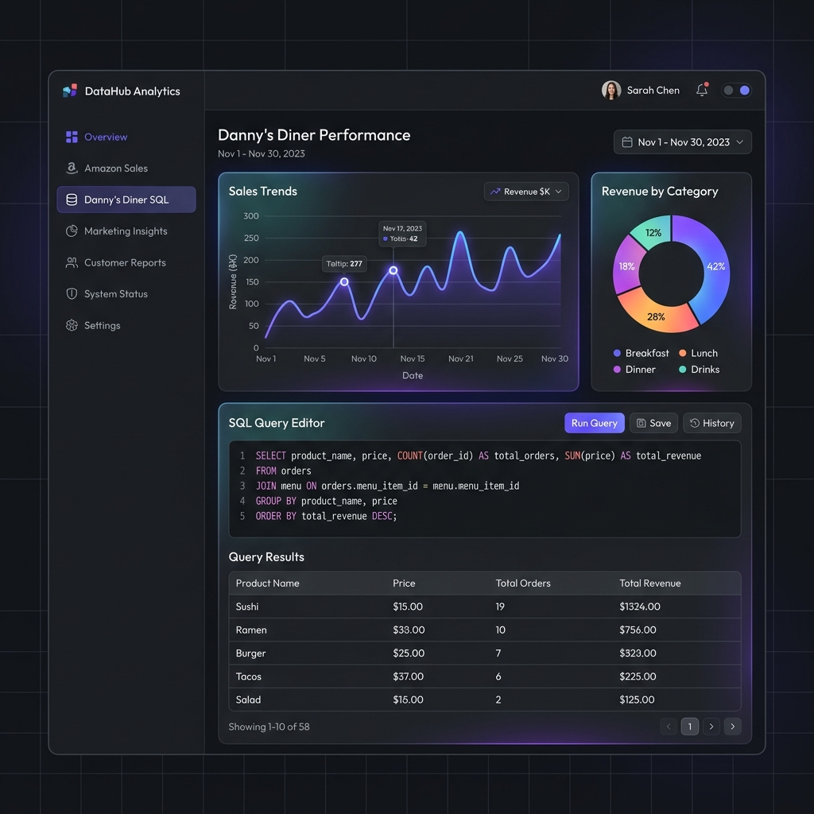

# 📊 Interactive Data Analytics & SQL Portfolio Portal



Welcome to the **Data Analytics & SQL Portfolio Portal**! This repository showcases end-to-end data analytics projects—featuring commercial sales trend analysis and restaurant loyalty program modeling—visualized through a custom, interactive full-stack web application.

---

## 🌟 Interactive Portal Features

### 1. 🛒 Amazon Sales Analysis Dashboard
An interactive dashboard displaying global sales statistics, margins, and distributions using real commercial data.
* **Key Metrics**: Dynamic calculations of Total Revenue, Total Profit, Profit Margin (%), Units Sold, and Average Order Value (AOV).
* **Interactive Charts** (via *Chart.js*):
  * Monthly Revenue & Profit Trendlines.
  * Product Category Revenue breakdowns.
  * Sales Channel mix (Online vs. Offline).
  * Regional Market share distribution.
* **Notebook Integration**: Access and read the full Python/Pandas analysis notebook directly inside the dashboard.

### 2. 🍜 Danny's Diner (SQL Case Study)
A SQL playground sandbox containing a complete dataset (Sales, Menu, Members tables) loaded into an in-memory SQLite database.
* **Preloaded Case Study Queries**: Quick-load any of the 10 loyalty case study questions (e.g., customer spending, point systems, and membership window promos).
* **Live SQL Runner**: Edit, write, and execute custom SQL queries directly in the browser and see real-time tables returned.

---

## 📈 Key Analytical Insights & Data Findings

### 🛒 1. Amazon Sales Insights (Based on CSV Dataset)
From our automated aggregation and analysis of the Amazon Sales dataset containing global orders, we found the following key trends:
- **Outstanding Profitability**: The channel generated **$88,640,049** in revenue, yielding **$29,796,419** in total profit with a strong average profit margin of **33.62%**.
- **Top Product Categories**: 
  - **Cosmetics** is the highest revenue generator, contributing **$24,002,280** (27% of total sales).
  - **Office Supplies** follows with **$16,726,980** in sales.
- **Geographic Demand**: **Europe** is the dominant region, accounting for **$31,333,305** in sales, followed by **Sub-Saharan Africa** at **$17,833,630**.
- **Channel Dynamics**: Sales channels are evenly split, with **Offline** generating **$44,471,756** and **Online** generating **$44,168,292**, indicating robust multi-channel operations.

### 🍜 2. Danny's Diner SQL Insights (Based on Case Study Queries)
Using SQL query optimization, we extracted the following metrics on restaurant loyalty and customer behaviour:

| Customer | Total Spent | Visited Days | Favorite Item | Loyalty Points |
|:---:|:---:|:---:|:---:|:---:|
| **A** | $76 | 4 Days | Ramen (3 purchases) | 860 Points |
| **B** | $74 | 6 Days | Sushi, Curry, Ramen (2 each) | 940 Points |
| **C** | $36 | 2 Days | Ramen (3 purchases) | 360 Points |

- **Product Popularity**: **Ramen** is the most popular menu item overall, with **8 orders** placed by all customers.
- **First Membership Order**: Customer **A** purchased **Curry** as their first meal after joining the loyalty program, whereas Customer **B** purchased **Sushi**.

---

## 💡 Strategic Business Recommendations

Based on the quantitative insights, we can make the following data-driven recommendations:

### 🛒 Amazon Sales Recommendations:
1. **Targeted Regional Allocation**: Over **55% of total revenue ($49.1M out of $88.6M)** is driven by **Europe and Sub-Saharan Africa**. Marketing budgets and inventory capacity should be disproportionately directed to these high-performing territories.
2. **Subscription Models for High-Value Goods**: **Cosmetics and Office Supplies** alone generate **over 45% of total sales**. Implementing recurring subscription plans or custom product bundles for these categories can lock in long-term customer lifetime value (LTV).
3. **Omnichannel Balance**: Offline and Online sales are highly balanced (representing an almost 50-50 split). A unified retail strategy (e.g., standard pricing, cross-channel loyalty integration) is essential to preserve customer satisfaction.

### 🍜 Danny's Diner Recommendations:
1. **Targeted Member Conversion**: **Customer C** is currently not a member but visits solely for **Ramen (representing 100% of their total spend)**. Offering a signup promo (e.g., "Get free Ramen on joining the loyalty program") is a high-probability strategy to convert them into a member.
2. **Promote Sushi during Membership Milestones**: Because **Sushi** awards double loyalty points, introducing targeted Sushi campaigns for existing members (Customers A & B) will drive higher order value and loyalty engagement.

---

## 🧠 Advanced SQL Query Techniques Showcase

This project implements advanced, clean database queries tailored to business scenarios:
* **Window Functions (`ROW_NUMBER()`, `DENSE_RANK()`)**: Utilized to partition transaction tables and identify chronological purchase sequences (e.g., first purchase post-membership).
* **Common Table Expressions (CTEs)**: Used to write modular, readable queries, avoiding deep subquery nesting and optimizing SQLite execution plans.
* **Conditional Aggregation (`CASE WHEN`)**: Employed to calculate dynamic, rule-based point systems and custom marketing promotional windows.

---

## 🛠️ Tech Stack & Architecture

- **Backend**: Python 3.11, Flask, Pandas, SQLite3 (multi-threaded shared cache)
- **Frontend**: HTML5, CSS3 (Glassmorphism layout, modern typography, transitions), JavaScript (ES6)
- **Data Visuals**: Chart.js (Interactive Charts CDN)
- **Deployment**: Render Blueprint (`render.yaml`), Gunicorn WSGI

---

## 💻 How to Run Locally

If you want to run this project on your local machine, follow these steps:

1. **Clone the Repository**:
   ```bash
   git clone https://github.com/YOUR_USERNAME/Data-Analytics-Projects-main.git
   cd Data-Analytics-Projects-main/Data-Analytics-Projects-main
   ```

2. **Install Dependencies**:
   ```bash
   pip install -r requirements.txt
   ```

3. **Start the Flask Server**:
   ```bash
   python server.py
   ```

4. **Open in Browser**:
   Navigate to **[http://127.0.0.1:5000](http://127.0.0.1:5000)** to interact with the workspace!
